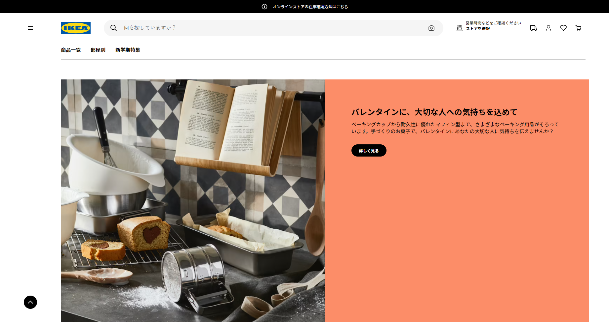

# IKEA Japan Homepage Clone
A clone of the IKEA Japan homepage built from scratch using vanilla HTML, CSS, JS.

This is purely an exercise in layout, design and select aspects of functionality (carousels). The menus/links do not do anything or lead anywhere.

## Contributing
Please do not submit pull request. This is just for practice.